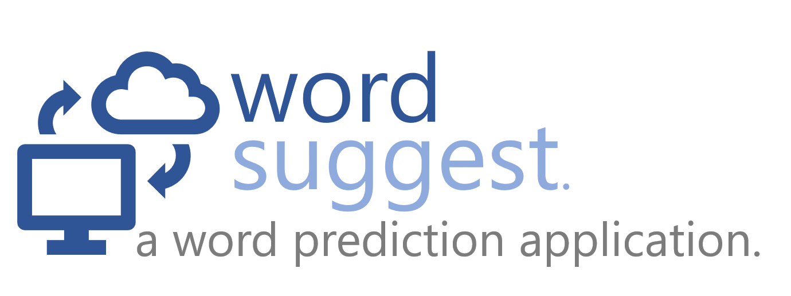

Capstone Project: Word Prediction Application
========================================================
author: Grejell B. Segura
date: November 29, 2018
autosize: true

Overview
========================================================
This application is a capstone project for the Coursera Data Science Specialization Course. It is designed to predict the next word when a phrase is entered. The data was taken from "https://d396qusza40orc.cloudfront.net/dsscapstone/dataset/Coursera-SwiftKey.zip" which includes news, blogs, and tweets collections. The algorithm used was the stupid backoff algorithm.

- The application allows the user to pick 3 economic indicators.
- The first input is for the X-axis, default value is Population Density.
- The second iput is for the Y-axis, default value is Population Annual Growth
- The 3rd input is the size scale, default value is Labor Force.

Here is the link for the app:
https://grejsegura.shinyapps.io/CourseraShinyApp/

Slide With Code
========================================================

Slide With Plot
========================================================

